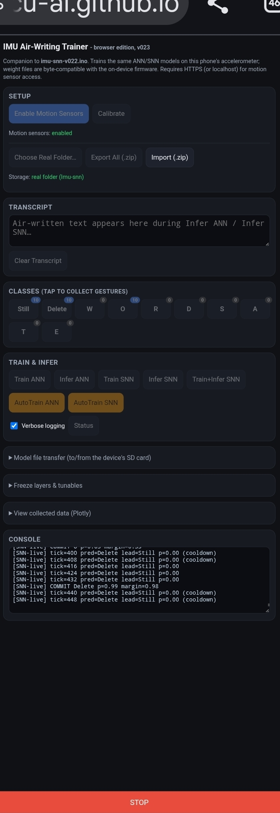

# on-device-motion-snn
spiking neural network testing

Claude made this. It is very cool, but wants access to a folder on your cell phone to save the motion data and the binary for the on-device model

Not even sure if I am OK doing this, but it is cool.

Demo Cell phone IMU webpage here when ready  https://webmcu-ai.github.io/on-device-motion-snn/index.html

## Probably a good idea to check with an AI if this has any damaging code in the index.html file.

This is all part of my on-device and webAI Github Organization at   https://github.com/webmcu-ai

Uses the XIAO ML Kit by Seeedstudio. https://www.seeedstudio.com/The-XIAOML-Kit.html  and the new Arduino IDE.

Just run the firmware.ino file and load whatever libraries would be needed.

Train using the serial monitor or the touch pad A0 (which is not very easy to use: tap to do things, multi-tap to exit menus)

# XIAO ESP32S3 Motion ML — Streaming SNN + Surrogate Gradients (v004)

## Overview

Dual-classifier gesture recognition sketch for a XIAO ESP32S3 (Sense/ML Kit)
with an onboard LSM6DS3 IMU, a 72x40 OLED, and a capacitive touch pad. It
recognizes three accelerometer-based gestures (`0Still`, `1Punch`, `2Wave`)
using **two independent, coexisting models** trained from the same captured
data, so they can be directly compared.

## The two models

### 1. ANN (windowed baseline)
- Captures a fixed **40-sample window** of raw XYZ accel.
- Architecture: `Conv1D (kernel=5, 8 filters) → MaxPool → Dense(32) → Dense(16) → Softmax(3)`.
- Trained with standard backprop + Adam, cross-entropy loss, mini-batches.
- Known-working baseline; classification only happens once per full window.

### 2. Streaming SNN (continuous, event-driven)
- Encodes the *derivative* of normalized accel per axis into ON/OFF spikes
  (delta/level-crossing encoding) → 6 spike channels.
- **Causal** Conv1D: a 5-sample ring buffer produces one LIF neuron output
  the instant a new IMU sample arrives — no waiting for a full window.
- Dense1/Dense2/Output are true LIF (leaky integrate-and-fire) neurons,
  updated every tick. Temporal context comes from membrane leak/integration,
  not from flattening a time window.
- **Training**: surrogate-gradient backprop-through-time (BPTT) over a
  recorded 40-tick repetition. Uses a fast-sigmoid surrogate derivative in
  place of the non-differentiable spike step function, with a *detached
  reset* (gradient doesn't flow through the "subtract threshold on spike"
  term) — the same approach used by libraries like snnTorch/Norse.
- **Inference** runs continuously off persistent streaming state (ring
  buffer + membrane potentials), producing a live prediction every tick via
  a decaying classification trace.
- Author's own notes flag this as carefully written but **untested on real
  hardware/data** — expect to tune `LEARNING_RATE`, `LIF_THRESHOLD`,
  `LIF_LEAK`, `DELTA_THRESHOLD`, and `SNN_WEIGHT_SCALE`.

## Shared infrastructure
- **Calibration**: 80-sample mean/std baseline captured on boot (or loaded
  from SD), used to normalize all accel input for both models.
- **Data capture**: per-class sample collection writes raw accel CSVs to SD
  (`/motion/<class>/sN.csv`), shared by both models' training pipelines.
- **Persistence**: both models' weights are saved to/loaded from SD
  (`myAnnWeights.bin`, `mySnnWeights.bin`) so training survives reboots.
- **Layer freezing**: each model has independent freeze flags per layer
  (conv1/dense1/dense2/output), toggled via Serial, gating the Adam update
  — useful for testing whether freezing early layers reduces catastrophic
  interference when adding new classes later.
- **UI**: touch tap = advance menu / capture sample; touch hold (3 taps) =
  select/exit; mirrored via Serial for headless use.

## v004 changes (this pass — observability + scalability only, no model changes)
- Every menu action (collect/train/infer) now prints a header banner on
  entry, event-level lines during execution, and a summary on exit.
- New `?` Serial command dumps full status: sample counts per class,
  ANN/SNN trained + freeze state, hyperparameters, free PSRAM.
- Train ANN/SNN track + report **best validation accuracy** and the epoch
  it occurred on, plus wall-clock training time.
- Streaming SNN screens report **spike rate** (spikes/tick since last
  report) instead of only a raw cumulative count — this is what's actually
  useful for tuning `LIF_THRESHOLD`/`SNN_WEIGHT_SCALE`/`DELTA_THRESHOLD`.
- **Hotkey redesign**: Serial digits `0`-`9` are now reserved exclusively
  for class selection (0-based), decoupled from menu position. The 5 fixed
  actions moved to letters (`G`/`H`/`J`/`K`/`M` = Train ANN / Infer ANN /
  Train SNN / Infer SNN / Train+Infer SNN). `NUM_CLASSES` can now grow to
  10 without ever renumbering an action (`static_assert` enforces the cap).
- OLED: shortened the menu instruction line, which was overflowing the
  72px-wide panel at the original font/size.

## Possible further optimizations

**Model / training**
- **Confusion matrix, not just accuracy** — with only 3 val samples/class,
  a single misclassification swings "accuracy" a lot; per-class precision
  would surface which gesture pair is actually confusable.
- **Early stopping / LR schedule** — currently always runs the full
  `TARGET_EPOCHS` at a fixed `LEARNING_RATE`; a simple decay or patience
  check would likely reach the same accuracy faster and reduce overfitting
  on small datasets.
- **Data augmentation** — small time-shifts, noise jitter, or magnitude
  scaling on the captured windows before training would help generalize
  from the (presumably small) sample counts per class.
- **SNN loss over the whole trace, not just the final tick** — right now
  cross-entropy is computed only on `rTrace` at `t = IMU_TIMESTEPS-1`.
  Summing (or averaging) loss across ticks is standard in SNN training and
  tends to give a stronger, less noisy gradient signal.
- **Quantization** — once either model is validated, int8 weights would
  cut PSRAM/flash use and could meaningfully speed up inference on-device.

**Streaming SNN specifics**
- **Adaptive threshold** — a per-neuron adaptive `LIF_THRESHOLD` (rises
  after each spike, decays otherwise) is a common fix for the "everything
  spikes every tick" failure mode without hand-tuning a single global
  constant.
- **Pooling gradient approximation** — the OR-pooling backward pass
  currently routes gradient equally to both source ticks (straight-through,
  like max-pool). A learned or spike-count-weighted split may train faster.
- **Per-tick memory-move cost** — `mySnnTick()` does a `memcpy`-shift of
  the whole ring buffer every tick to append one new sample; a small
  circular index would avoid the shift entirely and is a cheap win at
  40 Hz-class sampling rates.

**Data pipeline**
- **CSV parsing overhead** — `parseFloat()`/manual comma-skipping on every
  load is fine at this data scale but is the slowest part of training;
  switching to a compact binary format for captured reps (like the weight
  files already use) would speed up multi-epoch training noticeably as
  sample counts grow.
- **Class-imbalance guard** — training silently proceeds with whatever
  counts exist per class; a printed warning (or refusal) when one class has
  far fewer samples than others would catch a common source of biased
  models early.

**Firmware / UX**
- **Config load from SD** — `LEARNING_RATE`, `LIF_THRESHOLD`, etc. are
  compile-time constants; loading them from an SD config file (with the
  compiled values as defaults) would let you sweep hyperparameters without
  reflashing.
- **OLED space** — genuinely tight at 72x40; the practical ceiling has
  mostly been reached without a larger font or a second screen mode you
  page through — probably not worth more effort unless a bigger display is
  an option.
